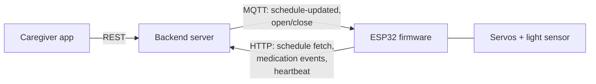
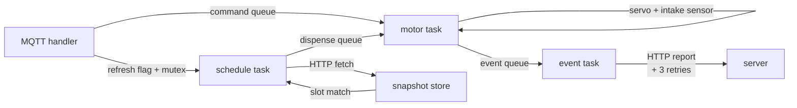

# ongi-device

> ESP32 FreeRTOS firmware for a connected medication dispenser, built to execute
> server-owned schedules, control slot hardware, and report verified intake events.

## Overview

**ongi-device** is the firmware for a six-slot medication dispenser, one part of a
service that also includes a mobile app and a backend server.

The requirement it solves: 
- a caregiver registers medication times in the app
- the device must open the right slot at the right time
- detect whether the medication was actually picked up
- get that result back into the caregiver's app even though the schedule data lives on the server.

The device works as an edge agent. The server is the source of truth for schedules.

The firmware:
- keeps a **local in-memory snapshot**
- executes it against **NTP-synced local time**
- **converts sensor readings** into medication events that flow back to the server

**MQTT** acts as the control plane (change notifications, remote commands) and **HTTP** as the data plane (schedule fetch, event reporting).

End-to-end flow:

1. Caregiver registers a schedule in the app; server stores it
2. Server publishes an MQTT `schedule-updated` notification to the device
3. Device re-fetches the full schedule over HTTP (device-token auth) and
   atomically replaces its in-memory snapshot
4. Schedule task compares slots against the synced RTC every second
5. On match: servo opens the slot, an ADS1115 light sensor watches 15 s for
   pill pickup, servo closes
6. Result becomes a `MEDICATION_TAKEN` / `MEDICATION_MISSED` event, sent to the
   server over HTTP with retry
7. Server records the event; the app shows the intake history

The device also accepts remote `OPEN_ALL` / `CLOSE_ALL` commands over MQTT,
with duplicate suppression and a 10-minute auto-close after `OPEN_ALL`. The
full app $\to$ server $\to$ device $\to$ sensor $\to$ server $\to$ app loop was demonstrated in an
integrated end-to-end demo (qualitative verification, not a measured
reliability claim).

## Architecture

System-wide, the device sits at the end of a notify-then-fetch contract.
- **MQTT** tells it that **something changed**
- **HTTP** is where it **reads and writes actual data**.



Inside the firmware, the core rule is that callbacks never do long work. 
- The **MQTT handler** only records a refresh request or enqueues a command.
- Each long-running concern is owned by exactly one **FreeRTOS task**, connected by queues.



### Key decisions

- Validation was layered through CI/TEST/DUMMY builds
    - schedule and event logic can run against dummy hardware before sensor, motor, and broker integration
    - making failures easier to localize to software, hardware, or network boundaries
- Snapshot apply is a full replacement under a mutex with a version counter
    - a failed fetch keeps the previous snapshot and retries after 5 s
    - so the device keeps executing the last known-good schedule through network faults
- Daily trigger records (slot/hour/minute/day) suppress duplicate dispenses
  when the same snapshot is re-applied
- Schedule execution is gated on SNTP sync, so a device with wrong time never
  opens a slot
- MQTT commands are deduplicated via the broker dup flag plus a 30s same-message window
    - remote commands and scheduled dispenses converge on a single motor task through a queue set
    - so hardware access needs no locking

## Tech Stack

| Technology | Role / Reason |
|---|---|
| ESP-IDF v6.0, C | Native ESP32 firmware stack with direct control over Wi-Fi, timers, I2C, PWM, and FreeRTOS primitives |
| FreeRTOS tasks, queues, queue sets, mutexes | Separates schedule execution, motor control, MQTT handling, and event reporting while keeping shared schedule state synchronized |
| MQTT + HTTP | MQTT carries low-latency notifications and remote commands; HTTP carries authoritative schedule fetches and medication-event reports |
| SNTP + RTC | Provides the local time base required for edge-side dispensing without a per-dose server command |
| ADS1115 over I2C, LEDC PWM servos | Reads analog intake-sensor values through an external ADC and drives six slot gates with ESP32 PWM output |
| GitHub Actions with ESP-IDF CI | Builds the firmware on every push and preserves a hardware-free validation path through CI build options |

## Validation

The firmware was **validated in layers** instead of only through full-device tests.

| Layer | Build / Mode | What it verifies |
|---|---|---|
| CI build | `idf.py -DCI_BUILD=1 build` | Builds in CI without private config headers and swaps hardware-dependent paths for dummy implementations |
| Logic-side test build | `TEST_BUILD` | Excludes real hardware and MQTT-dependent paths so schedule logic, event flow, and task handoff can be checked in isolation |
| Dummy schedule run | `DUMMY_TEST` under `TEST_BUILD` | Uses a hard-coded fixture schedule instead of fetching from the server, then verifies schedule execution, motor flow, and medication-event handling through logs |
| Network integration | normal build with MQTT/HTTP config | Verifies MQTT schedule notifications, remote commands, HTTP schedule fetch, and event reporting against configured services |
| Hardware integration | normal ESP32 flash build | Connects servo control, intake sensing path, and slot behavior after the software paths are stable |
| End-to-end demo | app + server + flashed device | Demonstrates the full app -> server -> device -> sensor -> server -> app loop |

## Getting Started

Requires ESP-IDF v6.0 and an ESP32 target. Provide real values for the
`*_config_example.h` templates under `components/` (Wi-Fi credentials, server
base URL, MQTT broker, device token) before building.

```sh
idf.py set-target esp32
idf.py build flash monitor
```

Hardware-free build with dummy drivers and a fixture schedule (same as CI):

```sh
idf.py -DCI_BUILD=1 build
```

## Limitations and Future Work

| Limitation | Future Work |
|---|---|
| Schedule snapshot, trigger records, and pending medication events live only in RAM; a reboot during a network outage loses unsent events | Durable event spool (SQLite/NVS): write events before send, mark on ack, replay after reboot |
| Event payload carries only slot number and status — no timestamp or idempotency key, so the server cannot distinguish a retry from a new event | Extend the event contract with device-side timestamp and per-event idempotency key |
| Motor task processes one job at a time: during the 15 s intake wait, remote `CLOSE_ALL` and the auto-close deadline are delayed | Priority or preemption path for safety-relevant commands |
| Schedule fetch and transient event retries are unbounded and treat permanent errors (4xx, malformed data) the same as transient ones | Classify permanent vs transient failures; bounded retry with backoff |
| Servo open/close failures and sensor anomalies are logged but never reported to the server | Device fault event model so caregivers can see hardware problems |
| Execution requires NTP sync after every boot; no offline fallback from persisted schedule + hardware clock | Define an offline execution policy with a persisted last-known schedule |
